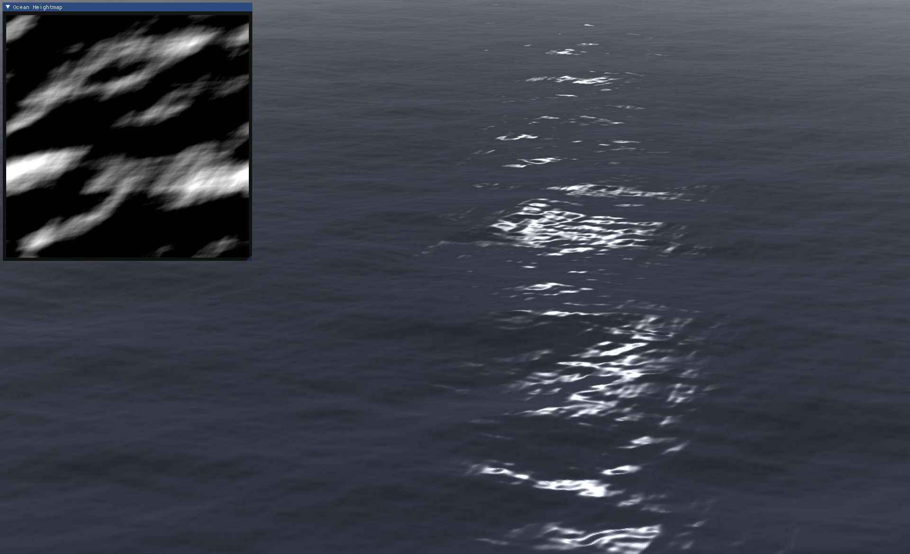

# SanctuaryEngine

This is the 5th rewrite of my graphics engine. The focus of this rewrite is to improve graphical effects and restructure the code architecture.

***This engine is a work in progress and more features will be added soon.***

___
## Features:

### Realistic Ocean Wave Simulation using the Discrete Inverse Fourier Transform

___
### Terrain Level of Detail using Tesselation

___
### Deferred Rendering

  
   

  
   

